# Arquitectura Técnica - Generador de Cuentos Infantiles n8n

## 1. Architecture design


## 2. Technology Description

- **Workflow Engine**: n8n@1.x + Node.js 18+
- **AI Services**: Google Gemini API + Nanobanana API
- **Cache Layer**: Redis 7.x
- **Storage**: Supabase Storage + PostgreSQL
- **PDF Generation**: Puppeteer + Custom HTML Templates
- **Monitoring**: n8n built-in metrics + Custom logging

## 3. Route definitions

| Route | Purpose |
|-------|---------|
| POST /webhook/generate-story | Endpoint principal para generar cuentos personalizados |
| GET /webhook/status/{id} | Consultar estado de generación en proceso |
| GET /webhook/download/{id} | Descargar PDF generado |
| POST /webhook/validate | Validar datos de entrada antes del procesamiento |

## 4. API definitions

### 4.1 Core API

**Generación de Cuento Personalizado**
```
POST /webhook/generate-story
```

Request (multipart/form-data):
| Param Name | Param Type | isRequired | Description |
|------------|------------|------------|-------------|
| photo | file | true | Imagen del niño (JPG/PNG, max 10MB) |
| name | string | true | Nombre del niño/niña |
| gender | string | true | Género: 'male', 'female', 'other' |
| interests | string | true | Intereses del niño (max 500 chars) |
| language | string | false | Idioma del cuento (default: 'es') |
| style | string | false | Estilo de historia: 'fantasy', 'adventure', 'educational' |

Response:
| Param Name | Param Type | Description |
|------------|------------|-------------|
| success | boolean | Estado de la operación |
| story_id | string | ID único del cuento generado |
| pdf_url | string | URL de descarga del PDF |
| processing_time | number | Tiempo de procesamiento en segundos |
| images_count | number | Número de imágenes generadas |

Example Request:
```json
{
  "name": "Sofia",
  "gender": "female",
  "interests": "dinosaurios, pintar, música clásica",
  "language": "es",
  "style": "fantasy"
}
```

Example Response:
```json
{
  "success": true,
  "story_id": "story_abc123",
  "pdf_url": "https://storage.supabase.co/stories/story_abc123.pdf",
  "processing_time": 45.2,
  "images_count": 5
}
```

**Consulta de Estado**
```
GET /webhook/status/{story_id}
```

Response:
| Param Name | Param Type | Description |
|------------|------------|-------------|
| status | string | 'processing', 'completed', 'failed' |
| progress | number | Porcentaje de completado (0-100) |
| current_step | string | Paso actual del procesamiento |
| estimated_time | number | Tiempo estimado restante en segundos |

## 5. Server architecture diagram

```mermaid
graph TD
    A[n8n Webhook Trigger] --> B[Input Validation Node]
    B --> C[Image Processing Node]
    C --> D[Cache Lookup Node]
    D --> E{Cache Hit?}
    E -->|Yes| F[Return Cached Result]
    E -->|No| G[Story Generation Service]
    G --> H[Image Generation Service]
    H --> I[PDF Assembly Service]
    I --> J[Storage Service]
    J --> K[Cache Update Node]
    K --> L[Response Node]
    
    subgraph "Error Handling Layer"
        M[Global Error Handler]
        N[Retry Logic]
        O[Fallback Responses]
    end
    
    subgraph "Monitoring Layer"
        P[Metrics Collection]
        Q[Performance Logging]
        R[Alert Triggers]
    end
```



## 6. Data model

### 6.1 Data model definition


### 6.2 Data Definition Language

**Story Request Table (story_requests)**
```sql
-- Crear tabla principal de solicitudes
CREATE TABLE story_requests (
    id UUID PRIMARY KEY DEFAULT gen_random_uuid(),
    name VARCHAR(100) NOT NULL,
    gender VARCHAR(10) CHECK (gender IN ('male', 'female', 'other')),
    interests TEXT NOT NULL,
    language VARCHAR(5) DEFAULT 'es',
    style VARCHAR(20) DEFAULT 'fantasy',
    photo_url TEXT,
    status VARCHAR(20) DEFAULT 'pending' CHECK (status IN ('pending', 'processing', 'completed', 'failed')),
    metadata JSONB DEFAULT '{}',
    created_at TIMESTAMP WITH TIME ZONE DEFAULT NOW(),
    updated_at TIMESTAMP WITH TIME ZONE DEFAULT NOW()
);

-- Crear índices para optimización
CREATE INDEX idx_story_requests_status ON story_requests(status);
CREATE INDEX idx_story_requests_created_at ON story_requests(created_at DESC);
CREATE INDEX idx_story_requests_name ON story_requests(name);

-- Tabla de contenido de historias
CREATE TABLE story_content (
    id UUID PRIMARY KEY DEFAULT gen_random_uuid(),
    story_request_id UUID REFERENCES story_requests(id) ON DELETE CASCADE,
    title VARCHAR(200) NOT NULL,
    content TEXT NOT NULL,
    chapters JSONB DEFAULT '[]',
    moral_lesson TEXT,
    generated_at TIMESTAMP WITH TIME ZONE DEFAULT NOW()
);

-- Tabla de imágenes generadas
CREATE TABLE generated_images (
    id UUID PRIMARY KEY DEFAULT gen_random_uuid(),
    story_request_id UUID REFERENCES story_requests(id) ON DELETE CASCADE,
    image_url TEXT NOT NULL,
    prompt_used TEXT,
    sequence_order INTEGER NOT NULL,
    generation_params JSONB DEFAULT '{}',
    created_at TIMESTAMP WITH TIME ZONE DEFAULT NOW()
);

-- Tabla de PDFs generados
CREATE TABLE pdf_outputs (
    id UUID PRIMARY KEY DEFAULT gen_random_uuid(),
    story_request_id UUID REFERENCES story_requests(id) ON DELETE CASCADE,
    pdf_url TEXT NOT NULL,
    file_size INTEGER,
    page_count INTEGER,
    layout_config JSONB DEFAULT '{}',
    generated_at TIMESTAMP WITH TIME ZONE DEFAULT NOW()
);

-- Tabla de cache
CREATE TABLE cache_entries (
    cache_key VARCHAR(255) PRIMARY KEY,
    cached_data JSONB NOT NULL,
    expires_at TIMESTAMP WITH TIME ZONE NOT NULL,
    cache_type VARCHAR(50) NOT NULL,
    created_at TIMESTAMP WITH TIME ZONE DEFAULT NOW()
);

-- Crear índice para limpieza automática de cache
CREATE INDEX idx_cache_entries_expires_at ON cache_entries(expires_at);

-- Permisos para Supabase
GRANT SELECT, INSERT, UPDATE ON story_requests TO anon;
GRANT ALL PRIVILEGES ON story_requests TO authenticated;
GRANT ALL PRIVILEGES ON story_content TO authenticated;
GRANT ALL PRIVILEGES ON generated_images TO authenticated;
GRANT ALL PRIVILEGES ON pdf_outputs TO authenticated;
GRANT SELECT, INSERT, DELETE ON cache_entries TO authenticated;

-- Datos iniciales de configuración
INSERT INTO cache_entries (cache_key, cached_data, expires_at, cache_type) VALUES
('config:pdf_templates', '{"default": {"font_family": "Nunito", "primary_color": "#FF6B6B"}}', NOW() + INTERVAL '1 year', 'config'),
('config:ai_prompts', '{"story_base": "Crea una historia mágica y educativa para un niño llamado {name}..."}', NOW() + INTERVAL '1 year', 'config');
```

## 7. n8n Workflow Configuration

### 7.1 Nodos Principales del Flujo

**1. Webhook Trigger Node**
```json
{
  "httpMethod": "POST",
  "path": "generate-story",
  "responseMode": "responseNode",
  "options": {
    "rawBody": false,
    "allowedOrigins": "*"
  }
}
```

**2. Input Validation Function Node**
```javascript
// Validación avanzada de entrada
const requiredFields = ['name', 'gender', 'interests'];
const allowedGenders = ['male', 'female', 'other'];
const maxInterestsLength = 500;

// Validar campos requeridos
for (const field of requiredFields) {
  if (!$input.first().json[field]) {
    throw new Error(`Campo requerido faltante: ${field}`);
  }
}

// Validar género
if (!allowedGenders.includes($input.first().json.gender)) {
  throw new Error('Género no válido');
}

// Validar longitud de intereses
if ($input.first().json.interests.length > maxInterestsLength) {
  throw new Error('Los intereses exceden la longitud máxima');
}

// Validar archivo de foto
const photo = $input.first().binary?.photo;
if (!photo) {
  throw new Error('Foto requerida');
}

// Validar tipo de archivo
const allowedTypes = ['image/jpeg', 'image/png', 'image/webp'];
if (!allowedTypes.includes(photo.mimeType)) {
  throw new Error('Tipo de archivo no soportado');
}

// Validar tamaño (max 10MB)
if (photo.fileSize > 10 * 1024 * 1024) {
  throw new Error('Archivo demasiado grande');
}

return $input.all();
```

**3. Cache Lookup Node (Redis)**
```json
{
  "operation": "get",
  "key": "=story_{{ $json.name }}_{{ $json.interests | hash }}",
  "keyType": "automatic"
}
```

**4. Gemini AI Story Generation**
```javascript
// Prompt optimizado para Gemini
const prompt = `
Eres un escritor experto en literatura infantil. Crea una historia mágica y educativa para un niño llamado ${$json.name} (género: ${$json.gender}).

INTERESES DEL NIÑO: ${$json.interests}

REQUISITOS:
- Historia de 800-1200 palabras
- Dividida en 5-6 capítulos cortos
- Incluye una moraleja positiva
- Lenguaje apropiado para niños de 4-10 años
- Incorpora los intereses del niño de manera creativa
- Usa pronombres correctos según el género
- Estilo narrativo moderno y atractivo

FORMATO DE RESPUESTA:
{
  "title": "Título de la historia",
  "chapters": [
    {
      "number": 1,
      "title": "Título del capítulo",
      "content": "Contenido del capítulo...",
      "image_prompt": "Descripción detallada para generar imagen"
    }
  ],
  "moral": "Moraleja de la historia"
}
`;

return [{
  json: {
    prompt: prompt,
    model: "gemini-1.5-pro",
    temperature: 0.8,
    max_tokens: 2000
  }
}];
```

### 7.2 Configuración de Error Handling

```javascript
// Global Error Handler Node
const error = $input.first().json.error;
const context = $input.first().json.context || {};

// Log del error
console.error('Error en flujo de cuentos:', {
  error: error.message,
  stack: error.stack,
  context: context,
  timestamp: new Date().toISOString()
});

// Respuesta de error estructurada
return [{
  json: {
    success: false,
    error: {
      code: error.code || 'INTERNAL_ERROR',
      message: 'Error procesando solicitud',
      details: process.env.NODE_ENV === 'development' ? error.message : undefined
    },
    timestamp: new Date().toISOString()
  }
}];
```

### 7.3 Optimizaciones de Performance

**Queue Management Node**
```javascript
// Control de concurrencia y rate limiting
const activeJobs = await $('Redis').first().json.active_jobs || 0;
const maxConcurrentJobs = 5;

if (activeJobs >= maxConcurrentJobs) {
  // Agregar a cola
  await $('Redis').first().json.queue.push({
    id: $json.story_id,
    data: $json,
    timestamp: Date.now()
  });
  
  return [{
    json: {
      status: 'queued',
      position: await $('Redis').first().json.queue.length,
      estimated_wait: activeJobs * 30 // segundos
    }
  }];
}

return $input.all();
```