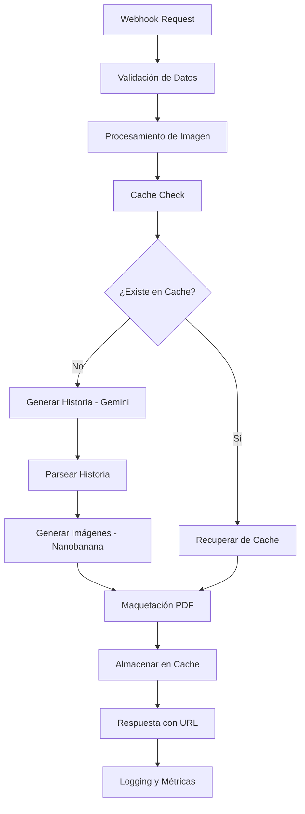

# Generador de Cuentos Infantiles Personalizados - n8n

## 1. Product Overview

Sistema automatizado que transforma una fotografía y los intereses de un niño en un cuento personalizado ilustrado con PDF de alta calidad. Utiliza IA generativa para crear historias únicas y genera imágenes personalizadas que incorporan los rasgos del niño como protagonista.

El producto resuelve la necesidad de contenido educativo y entretenimiento personalizado para niños, permitiendo a padres y educadores crear material único que conecte emocionalmente con cada niño. Dirigido al mercado de edtech, entretenimiento infantil y servicios de personalización digital.

## 2. Core Features

### 2.1 User Roles

| Role | Registration Method | Core Permissions |
|------|---------------------|------------------|
| Usuario Final | API Key o acceso directo | Puede generar cuentos, descargar PDFs |
| Administrador | Configuración de sistema | Gestión completa, monitoreo, configuración de APIs |

### 2.2 Feature Module

Nuestro generador de cuentos consiste en los siguientes módulos principales:

1. **Módulo de Entrada**: recepción de datos, validación de archivos, procesamiento de imágenes.
2. **Módulo de Generación de Historia**: integración con Gemini AI, personalización de narrativa, control de calidad.
3. **Módulo de Ilustración**: generación de imágenes con Nanobanana AI, procesamiento facial, composición visual.
4. **Módulo de Maquetación**: diseño de PDF, tipografía avanzada, layout responsivo.
5. **Módulo de Entrega**: almacenamiento, distribución, notificaciones.

### 2.3 Page Details

| Page Name | Module Name | Feature description |
|-----------|-------------|---------------------|
| Webhook Endpoint | Recepción de Datos | Recibe multipart/form-data con foto, nombre, género, intereses y idioma. Valida formatos y tamaños de archivo |
| Procesamiento de Imagen | Análisis Facial | Extrae características faciales, optimiza resolución, genera embeddings para referencia en ilustraciones |
| Generación de Historia | IA Narrativa | Crea historia personalizada usando Gemini con prompts optimizados, incorpora elementos de los intereses del niño |
| Creación de Ilustraciones | IA Visual | Genera 4-6 imágenes ilustrativas usando Nanobanana, mantiene consistencia del personaje principal |
| Maquetación de PDF | Diseño Editorial | Combina texto e imágenes en layout profesional con tipografías infantiles, colores vibrantes y elementos decorativos |
| Sistema de Cache | Optimización | Almacena resultados intermedios para mejorar rendimiento y reducir costos de API |
| Monitoreo y Logs | Observabilidad | Registra métricas de rendimiento, errores y uso de recursos para optimización continua |

## 3. Core Process

**Flujo Principal del Usuario:**
1. El usuario envía una solicitud POST al webhook con la foto del niño y sus datos
2. El sistema valida y procesa la imagen, extrayendo características faciales
3. Gemini AI genera una historia personalizada basada en los intereses proporcionados
4. El sistema divide la historia en segmentos y genera prompts para ilustraciones
5. Nanobanana AI crea múltiples imágenes manteniendo la consistencia del personaje
6. El motor de maquetación combina historia e imágenes en un PDF profesional
7. El sistema devuelve la URL del PDF generado y almacena métricas

**Flujo de Administrador:**
1. Configuración inicial de APIs y variables de entorno
2. Monitoreo de métricas de uso y rendimiento
3. Gestión de cache y optimización de recursos
4. Mantenimiento de templates y estilos de PDF

## 4. User Interface Design

### 4.1 Design Style

- **Colores Primarios**: #FF6B6B (coral vibrante), #4ECDC4 (turquesa suave)
- **Colores Secundarios**: #45B7D1 (azul cielo), #96CEB4 (verde menta), #FFEAA7 (amarillo cálido)
- **Tipografía PDF**: 
  - Títulos: "Fredoka One" (Google Fonts) - 24-32px
  - Texto principal: "Open Sans" - 14-16px
  - Texto narrativo: "Nunito" - 12-14px
- **Estilo de Layout**: Diseño tipo libro infantil con márgenes generosos, espaciado amplio
- **Elementos Visuales**: Bordes redondeados, sombras suaves, iconos SVG coloridos, marcos decorativos

### 4.2 Page Design Overview

| Page Name | Module Name | UI Elements |
|-----------|-------------|-------------|
| PDF Cover | Portada | Título personalizado con nombre del niño, ilustración principal, marco decorativo con colores vibrantes, tipografía Fredoka One 32px |
| PDF Content | Páginas de Historia | Layout de dos columnas (texto/imagen), márgenes 40px, interlineado 1.6, imágenes con bordes redondeados 15px |
| PDF Back | Contraportada | Mensaje personalizado, créditos, código QR opcional, elementos decorativos temáticos |

### 4.3 Responsiveness

El PDF está optimizado para impresión A4 y visualización digital, con elementos escalables y tipografías que mantienen legibilidad en diferentes tamaños. Incluye versiones optimizadas para tablet y móvil.