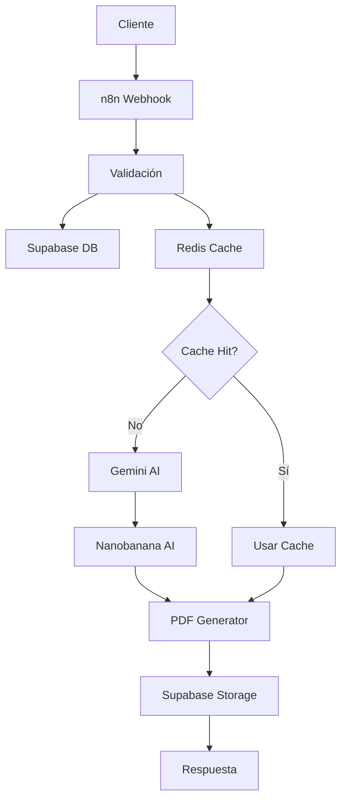

# 🎨 Generador de Cuentos Infantiles con n8n

Un sistema completo para generar cuentos infantiles personalizados utilizando n8n, inteligencia artificial y tecnologías modernas.

## 🌟 Características Principales

- **🤖 IA Avanzada**: Integración con Gemini AI para generación de historias y Nanobanana para ilustraciones
- **📚 Personalización Completa**: Cuentos adaptados por nombre, género, intereses y estilo
- **🎨 4 Estilos Únicos**: Fantasía, Aventura, Educativo y Científico
- **📄 PDFs Profesionales**: Generación automática con diseño atractivo
- **🌍 Multiidioma**: Soporte para español e inglés
- **📸 Integración de Fotos**: Incluye fotos del niño/a en el cuento
- **⚡ Cache Inteligente**: Sistema Redis para optimizar rendimiento
- **🔄 Flujo n8n**: Workflow visual y escalable

## 🏗️ Arquitectura del Sistema



## 🚀 Inicio Rápido

### 1. Prerrequisitos

- Node.js 18+
- Cuenta en Supabase
- API Keys de Gemini y Nanobanana
- Redis (opcional, recomendado)

### 2. Instalación

```bash
# Clonar repositorio
git clone <repository-url>
cd n8n-cuentos-infantiles

# Instalar dependencias
npm install

# Configurar variables de entorno
cp .env.example .env
# Editar .env con tus configuraciones

# Ejecutar setup automático
node scripts/setup.js
```

### 3. Configuración de Base de Datos

```bash
# Migrar esquemas a Supabase
node scripts/migrate-supabase.js
```

### 4. Iniciar el Sistema

```bash
# Desarrollo
npm run dev

# Producción
npm start
```

### 5. Importar Workflow n8n

1. Accede a http://localhost:5678
2. Ve a **Workflows** > **Import from File**
3. Selecciona `workflows/cuento-generator.json`
4. Configura las credenciales necesarias

## 📖 Uso Básico

### Generar un Cuento

```bash
curl -X POST http://localhost:5678/webhook/generate-story \
  -H "Content-Type: application/json" \
  -d '{
    "name": "Sofia",
    "gender": "female",
    "interests": "dinosaurios y ciencia",
    "style": "educational",
    "language": "es"
  }'
```

### Respuesta

```json
{
  "success": true,
  "story_id": "uuid-string",
  "pdf_url": "https://storage-url/cuento.pdf",
  "title": "Sofia y los Dinosaurios Científicos",
  "processing_time": 45.2,
  "images_count": 4,
  "word_count": 750
}
```

## 🎨 Estilos Disponibles

| Estilo | Descripción | Elementos |
|--------|-------------|-----------|
| **Fantasy** | Cuentos mágicos | Dragones, hadas, castillos |
| **Adventure** | Historias de exploración | Mapas, tesoros, naturaleza |
| **Educational** | Aprendizaje divertido | Experimentos, conceptos |
| **Scientific** | Ciencia y tecnología | Robots, laboratorios, espacio |

## 🔧 Configuración

### Variables de Entorno Principales

```bash
# n8n
N8N_HOST=localhost
N8N_PORT=5678

# Supabase
SUPABASE_URL=https://tu-proyecto.supabase.co
SUPABASE_ANON_KEY=tu-clave-anonima
SUPABASE_SERVICE_ROLE_KEY=tu-clave-service-role

# IA Services
GEMINI_API_KEY=tu-gemini-api-key
NANOBANANA_API_KEY=tu-nanobanana-api-key

# Redis (opcional)
REDIS_HOST=localhost
REDIS_PORT=6379
```

## 📁 Estructura del Proyecto

```
n8n-cuentos-infantiles/
├── 📁 workflows/           # Workflows de n8n
│   └── cuento-generator.json
├── 📁 supabase/           # Esquemas de base de datos
│   ├── schema.sql
│   └── storage.sql
├── 📁 templates/          # Plantillas HTML/CSS
│   ├── story-template.hbs
│   └── pdf-styles.css
├── 📁 lib/               # Librerías y utilidades
│   └── pdf-generator.js
├── 📁 scripts/           # Scripts de configuración
│   ├── setup.js
│   ├── migrate-supabase.js
│   ├── deploy.js
│   └── health-check.js
├── 📁 docs/              # Documentación
│   ├── api-documentation.md
│   ├── configuration-guide.md
│   └── examples.md
└── 📁 temp/              # Archivos temporales
    ├── pdfs/
    └── images/
```

## 🧪 Testing

### Verificar Salud del Sistema

```bash
node scripts/health-check.js
```

### Test de Generación

```bash
# Test básico
curl -X POST http://localhost:5678/webhook/generate-story \
  -H "Content-Type: application/json" \
  -d '{
    "name": "Test",
    "gender": "other",
    "interests": "robots",
    "style": "scientific"
  }'
```

### Ejecutar Tests Automatizados

```bash
npm test
```

## 📊 Monitoreo

### Verificar Estado

```bash
# Estado de un cuento específico
curl -X GET http://localhost:5678/webhook/story-status/{story_id}

# Salud general del sistema
curl -X GET http://localhost:5678/webhook/health

# Estadísticas de uso
curl -X GET http://localhost:5678/webhook/stats
```

### Logs

```bash
# Ver logs en tiempo real
tail -f logs/app.log

# Filtrar errores
grep "ERROR" logs/app.log
```

## 🔒 Seguridad

- **Autenticación**: API Keys y tokens seguros
- **Validación**: Sanitización completa de inputs
- **Rate Limiting**: Protección contra abuso
- **RLS**: Políticas de seguridad en Supabase
- **Encriptación**: Datos sensibles protegidos

## 🚀 Deployment

### Desarrollo Local

```bash
npm run dev
```

### Producción con PM2

```bash
# Instalar PM2
npm install -g pm2

# Iniciar aplicación
pm2 start ecosystem.config.js

# Configurar auto-inicio
pm2 startup
pm2 save
```

### Docker (Opcional)

```bash
# Construir imagen
docker build -t cuentos-infantiles .

# Ejecutar contenedor
docker run -d -p 5678:5678 --env-file .env cuentos-infantiles
```

## 📚 Documentación

- **[📖 API Documentation](./docs/api-documentation.md)** - Referencia completa de la API
- **[⚙️ Configuration Guide](./docs/configuration-guide.md)** - Guía detallada de configuración
- **[💡 Examples](./docs/examples.md)** - Ejemplos prácticos de uso

## 🛠️ Scripts Disponibles

| Script | Descripción |
|--------|-------------|
| `npm start` | Iniciar en producción |
| `npm run dev` | Iniciar en desarrollo |
| `npm run setup` | Configuración inicial |
| `npm run migrate` | Migrar base de datos |
| `npm test` | Ejecutar tests |
| `npm run build` | Construir para producción |

## 🔧 Troubleshooting

### Problemas Comunes

#### Error de Conexión a Supabase
```bash
# Verificar configuración
echo $SUPABASE_URL
echo $SUPABASE_ANON_KEY

# Test de conexión
node -e "
const { createClient } = require('@supabase/supabase-js');
const client = createClient(process.env.SUPABASE_URL, process.env.SUPABASE_ANON_KEY);
console.log('Conexión exitosa');
"
```

#### Redis No Disponible
```bash
# Iniciar Redis con Docker
docker run -d --name redis-cuentos -p 6379:6379 redis:alpine

# Verificar conexión
redis-cli ping
```

#### Cuota de API Excedida
```bash
# Verificar límites en Google Cloud Console
# Implementar cache más agresivo
export REDIS_TTL=7200
```

## 🤝 Contribuir

1. Fork el proyecto
2. Crea una rama para tu feature (`git checkout -b feature/AmazingFeature`)
3. Commit tus cambios (`git commit -m 'Add some AmazingFeature'`)
4. Push a la rama (`git push origin feature/AmazingFeature`)
5. Abre un Pull Request

## 📄 Licencia

Este proyecto está bajo la Licencia MIT. Ver `LICENSE` para más detalles.

## 🙏 Agradecimientos

- **n8n** - Plataforma de automatización
- **Supabase** - Backend como servicio
- **Google Gemini** - IA para generación de texto
- **Nanobanana** - IA para generación de imágenes
- **Puppeteer** - Generación de PDFs

## 📞 Soporte

- **Email**: soporte@cuentos-infantiles.com
- **Documentación**: https://docs.cuentos-infantiles.com
- **Issues**: https://github.com/proyecto/issues

---

**¡Crea historias mágicas que inspiren a los niños! ✨**