# 📚 Documentación de API - Generador de Cuentos Infantiles

## 🌟 Descripción General

El Generador de Cuentos Infantiles es un sistema basado en n8n que utiliza inteligencia artificial para crear historias personalizadas y generar PDFs con diseño profesional. El sistema integra múltiples servicios de IA y proporciona una API RESTful para la generación de contenido.

## 🏗️ Arquitectura del Sistema

```mermaid
graph TB
    A[Cliente] --> B[n8n Webhook]
    B --> C[Validación de Datos]
    C --> D[Supabase DB]
    C --> E[Cache Redis]
    E --> F{¿Cache Hit?}
    F -->|Sí| G[Usar Cache]
    F -->|No| H[Gemini AI]
    H --> I[Nanobanana AI]
    I --> J[Generador PDF]
    J --> K[Supabase Storage]
    G --> J
    K --> L[Respuesta Final]
```



## 🔗 Endpoints de la API

### 1. Generar Cuento Personalizado

**Endpoint:** `POST /webhook/generate-story`

**Descripción:** Genera un cuento infantil personalizado con ilustraciones y PDF.

#### Parámetros de Entrada

```json
{
  "name": "string (requerido)",
  "gender": "string (requerido: 'male', 'female', 'other')",
  "interests": "string (requerido)",
  "language": "string (opcional: 'es', 'en', default: 'es')",
  "style": "string (opcional: 'fantasy', 'adventure', 'educational', 'scientific', default: 'fantasy')",
  "photo": "file (opcional)",
  "photo_url": "string (opcional)"
}
```

#### Ejemplo de Petición

```bash
curl -X POST http://localhost:5678/webhook/generate-story \
  -H "Content-Type: application/json" \
  -d '{
    "name": "Sofia",
    "gender": "female",
    "interests": "dinosaurios y ciencia",
    "language": "es",
    "style": "educational",
    "photo_url": "https://example.com/photo.jpg"
  }'
```

#### Respuesta Exitosa (200)

```json
{
  "success": true,
  "story_id": "uuid-string",
  "pdf_url": "https://supabase-storage-url/cuento.pdf",
  "title": "La Aventura Científica de Sofia",
  "processing_time": 45.2,
  "images_count": 4,
  "word_count": 750,
  "chapters": 4,
  "download_url": "https://supabase-storage-url/cuento.pdf",
  "timestamp": "2024-01-20T10:30:00.000Z"
}
```

#### Respuesta de Error (400)

```json
{
  "success": false,
  "error": "Campos requeridos: name, gender, interests",
  "timestamp": "2024-01-20T10:30:00.000Z"
}
```

### 2. Consultar Estado de Generación

**Endpoint:** `GET /webhook/story-status/{story_id}`

**Descripción:** Consulta el estado de generación de un cuento.

#### Parámetros

- `story_id`: UUID del cuento generado

#### Respuesta

```json
{
  "story_id": "uuid-string",
  "status": "processing|completed|error",
  "progress": 75,
  "current_step": "generating_images",
  "estimated_completion": "2024-01-20T10:35:00.000Z",
  "created_at": "2024-01-20T10:30:00.000Z"
}
```

### 3. Descargar PDF

**Endpoint:** `GET /webhook/download/{story_id}`

**Descripción:** Descarga el PDF generado de un cuento.

#### Respuesta

- **Content-Type:** `application/pdf`
- **Content-Disposition:** `attachment; filename="cuento_sofia.pdf"`

## 🔧 Configuración del Sistema

### Variables de Entorno Requeridas

```bash
# n8n Configuration
N8N_HOST=localhost
N8N_PORT=5678
N8N_PROTOCOL=http

# Webhook Configuration
WEBHOOK_URL=http://localhost:5678/webhook

# Supabase Configuration
SUPABASE_URL=https://tu-proyecto.supabase.co
SUPABASE_ANON_KEY=tu-clave-anonima
SUPABASE_SERVICE_ROLE_KEY=tu-clave-service-role

# AI Services
GEMINI_API_KEY=tu-gemini-api-key
NANOBANANA_API_KEY=tu-nanobanana-api-key

# Redis Cache
REDIS_HOST=localhost
REDIS_PORT=6379
REDIS_PASSWORD=opcional

# Storage Configuration
STORAGE_BASE_URL=https://tu-proyecto.supabase.co/storage/v1/object/public
PDF_TEMP_PATH=./temp/pdfs
IMAGES_TEMP_PATH=./temp/images

# PDF Generation
PDF_TIMEOUT=60000
PDF_QUALITY=high
PDF_FORMAT=A4

# Monitoring & Logging
LOG_LEVEL=info
ENABLE_ANALYTICS=true
SENTRY_DSN=opcional

# Rate Limiting
RATE_LIMIT_WINDOW=900000
RATE_LIMIT_MAX_REQUESTS=10

# Queue Configuration
QUEUE_CONCURRENCY=3
QUEUE_MAX_RETRIES=3
QUEUE_RETRY_DELAY=5000
```

## 🎨 Estilos de Cuento Disponibles

### 1. Fantasy (Fantasía)
- **Descripción:** Cuentos mágicos con criaturas fantásticas
- **Colores:** Púrpuras, azules, dorados
- **Elementos:** Dragones, hadas, castillos, magia

### 2. Adventure (Aventura)
- **Descripción:** Historias de exploración y descubrimiento
- **Colores:** Naranjas, verdes, marrones
- **Elementos:** Mapas, tesoros, viajes, naturaleza

### 3. Educational (Educativo)
- **Descripción:** Cuentos que enseñan conceptos específicos
- **Colores:** Azules, verdes, amarillos
- **Elementos:** Libros, experimentos, aprendizaje

### 4. Scientific (Científico)
- **Descripción:** Historias sobre ciencia y tecnología
- **Colores:** Morados, cianes, verdes
- **Elementos:** Laboratorios, robots, espacio, inventos

## 🗄️ Estructura de Base de Datos

### Tabla: story_requests

```sql
CREATE TABLE story_requests (
    id UUID PRIMARY KEY DEFAULT gen_random_uuid(),
    name VARCHAR(100) NOT NULL,
    gender VARCHAR(10) NOT NULL,
    interests TEXT NOT NULL,
    language VARCHAR(5) DEFAULT 'es',
    style VARCHAR(20) DEFAULT 'fantasy',
    status VARCHAR(20) DEFAULT 'pending',
    photo_url TEXT,
    created_at TIMESTAMP DEFAULT NOW(),
    processing_started_at TIMESTAMP,
    processing_completed_at TIMESTAMP,
    error_message TEXT
);
```

### Tabla: story_content

```sql
CREATE TABLE story_content (
    id UUID PRIMARY KEY DEFAULT gen_random_uuid(),
    story_request_id UUID REFERENCES story_requests(id),
    title VARCHAR(200) NOT NULL,
    content JSONB NOT NULL,
    chapters JSONB NOT NULL,
    moral_lesson TEXT,
    word_count INTEGER,
    ai_model_used VARCHAR(50),
    created_at TIMESTAMP DEFAULT NOW()
);
```

### Tabla: generated_images

```sql
CREATE TABLE generated_images (
    id UUID PRIMARY KEY DEFAULT gen_random_uuid(),
    story_request_id UUID REFERENCES story_requests(id),
    image_url TEXT NOT NULL,
    image_type VARCHAR(20) DEFAULT 'illustration',
    prompt_used TEXT,
    sequence_order INTEGER,
    generation_params JSONB,
    ai_model_used VARCHAR(50),
    created_at TIMESTAMP DEFAULT NOW()
);
```

### Tabla: pdf_outputs

```sql
CREATE TABLE pdf_outputs (
    id UUID PRIMARY KEY DEFAULT gen_random_uuid(),
    story_request_id UUID REFERENCES story_requests(id),
    pdf_url TEXT NOT NULL,
    file_size_bytes BIGINT,
    generation_time_seconds DECIMAL(10,2),
    template_used VARCHAR(50),
    created_at TIMESTAMP DEFAULT NOW()
);
```

## 🔄 Flujo de Procesamiento

### 1. Recepción de Datos
- Validación de campos requeridos
- Normalización de datos de entrada
- Creación de registro en base de datos

### 2. Verificación de Cache
- Generación de clave de cache basada en intereses y estilo
- Consulta a Redis para contenido existente
- Decisión de usar cache o generar nuevo contenido

### 3. Generación de Historia (Gemini AI)
- Construcción de prompt personalizado
- Llamada a API de Gemini
- Procesamiento y validación de respuesta
- Almacenamiento en base de datos

### 4. Generación de Imágenes (Nanobanana AI)
- Procesamiento por capítulos
- Generación de prompts mejorados para imágenes
- Llamadas paralelas a API de Nanobanana
- Almacenamiento de URLs de imágenes

### 5. Generación de PDF
- Compilación de template HTML con Handlebars
- Aplicación de estilos CSS personalizados
- Generación de PDF con Puppeteer
- Subida a Supabase Storage

### 6. Finalización
- Actualización de estado en base de datos
- Limpieza de archivos temporales
- Respuesta al cliente con URLs de descarga

## 🚀 Instalación y Configuración

### 1. Prerrequisitos

```bash
# Node.js 18+
node --version

# npm o pnpm
npm --version

# Docker (opcional para Redis)
docker --version
```

### 2. Instalación

```bash
# Clonar repositorio
git clone <repository-url>
cd n8n-cuentos-infantiles

# Instalar dependencias
npm install

# Configurar variables de entorno
cp .env.example .env
# Editar .env con tus configuraciones

# Ejecutar migraciones de base de datos
node scripts/migrate-supabase.js

# Iniciar servicios
npm run dev
```

### 3. Configuración de n8n

1. Acceder a http://localhost:5678
2. Crear cuenta de administrador
3. Importar workflow desde `workflows/cuento-generator.json`
4. Configurar credenciales:
   - Supabase API
   - Gemini API Key
   - Nanobanana API Key

## 🧪 Testing

### Pruebas Manuales

```bash
# Test básico de generación
curl -X POST http://localhost:5678/webhook/generate-story \
  -H "Content-Type: application/json" \
  -d '{
    "name": "Test",
    "gender": "other",
    "interests": "robots",
    "style": "scientific"
  }'

# Verificar salud del sistema
node scripts/health-check.js

# Ejecutar tests automatizados
npm test
```

### Pruebas de Carga

```bash
# Instalar herramienta de testing
npm install -g artillery

# Ejecutar pruebas de carga
artillery run tests/load-test.yml
```

## 📊 Monitoreo y Analytics

### Métricas Disponibles

- **Tiempo de procesamiento:** Tiempo total de generación
- **Tasa de éxito:** Porcentaje de generaciones exitosas
- **Uso de cache:** Porcentaje de hits de cache
- **Uso de APIs:** Llamadas a servicios externos
- **Tamaño de PDFs:** Estadísticas de archivos generados

### Logs del Sistema

```bash
# Ver logs en tiempo real
tail -f logs/app.log

# Filtrar errores
grep "ERROR" logs/app.log

# Estadísticas de uso
node scripts/analytics.js
```

## 🔒 Seguridad

### Autenticación
- API Keys para servicios externos
- Tokens de acceso para Supabase
- Rate limiting por IP

### Validación de Datos
- Sanitización de inputs
- Validación de tipos de archivo
- Límites de tamaño de contenido

### Almacenamiento Seguro
- Encriptación de datos sensibles
- Políticas de acceso en Supabase
- Limpieza automática de archivos temporales

## 🐛 Troubleshooting

### Problemas Comunes

#### Error: "Supabase connection failed"
```bash
# Verificar configuración
echo $SUPABASE_URL
echo $SUPABASE_ANON_KEY

# Probar conexión
node -e "
const { createClient } = require('@supabase/supabase-js');
const client = createClient(process.env.SUPABASE_URL, process.env.SUPABASE_ANON_KEY);
console.log('Conexión exitosa');
"
```

#### Error: "Redis connection refused"
```bash
# Iniciar Redis con Docker
docker run -d --name redis-cuentos -p 6379:6379 redis:alpine

# Verificar conexión
redis-cli ping
```

#### Error: "Gemini API quota exceeded"
```bash
# Verificar cuota en Google Cloud Console
# Implementar rate limiting adicional
# Usar cache más agresivo
```

### Logs de Debug

```bash
# Habilitar logs detallados
export LOG_LEVEL=debug

# Ver logs de n8n
docker logs n8n-container

# Verificar estado de servicios
node scripts/health-check.js
```

## 📈 Optimización de Performance

### Cache Strategy
- Cache de historias por intereses similares
- Cache de imágenes generadas
- TTL configurables por tipo de contenido

### Optimización de APIs
- Batch processing para imágenes
- Retry logic con backoff exponencial
- Connection pooling para base de datos

### Optimización de PDFs
- Compresión de imágenes
- Optimización de fuentes
- Lazy loading de recursos

## 🔄 Actualizaciones y Mantenimiento

### Backup de Datos
```bash
# Backup de base de datos
node scripts/backup-database.js

# Backup de archivos
tar -czf backup-$(date +%Y%m%d).tar.gz temp/ uploads/
```

### Actualizaciones del Sistema
```bash
# Actualizar dependencias
npm update

# Migrar base de datos
node scripts/migrate-supabase.js

# Reiniciar servicios
npm run restart
```

## 📞 Soporte

### Contacto
- **Email:** soporte@cuentos-infantiles.com
- **Documentación:** https://docs.cuentos-infantiles.com
- **Issues:** https://github.com/proyecto/issues

### Recursos Adicionales
- [Guía de Configuración](./configuration-guide.md)
- [Ejemplos de Uso](./examples.md)
- [FAQ](./faq.md)
- [Changelog](./CHANGELOG.md)

---

*Documentación generada automáticamente - Versión 1.0.0*